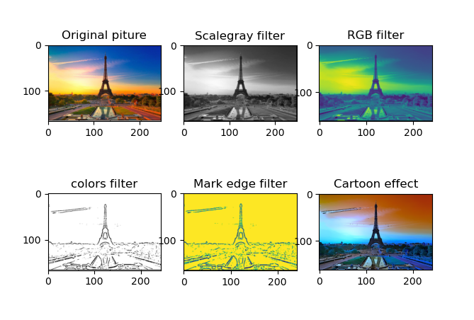

# Image processing
]
]
* The first step of this project is to do image processing and discover all packages and functions to do that.(done)
* The second step is to implement a machine learning model.(In progress)

## Installation:
> Download the ipynb file and launch your jupyter notebook

## First results:
#### Using some known packages and functions for image processing.

#### Using some algorithms: Canny's Algorithm - Adaptive threshold ...

